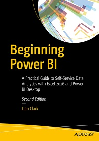
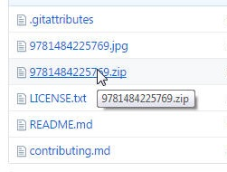
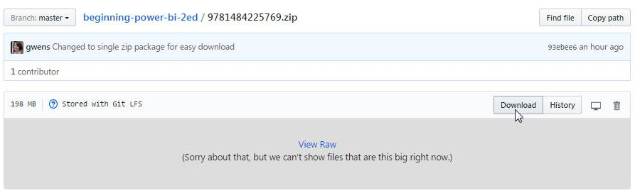

# Apress Source Code

This repository accompanies [*Beginning Power BI*](http://www.apress.com/9781484225769) by Dan Clark (Apress, 2017).

## Instructions

This repository contains a large file, which cannot be downloaded using the 'Download as zip' option via the green button. To download the package:

1. Select the file **9781484225769.zip** in your browser window.

2. Select **Download** to download the file from Git Large File Storage (LFS).

Alternatively, you can clone the entire repository to your machine using Git or GitHub Desktop.

## Releases

Release v1.0 corresponds to the code in the published book, without corrections or updates.

## Contributions

See the file Contributing.md for more information on how you can contribute to this repository.
